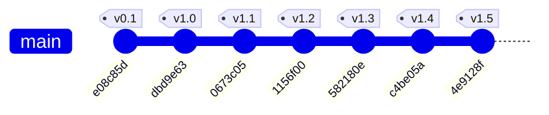

# Engineering Analysis & Development Process: Krishna Janmashtami 2026

A comprehensive technical analysis of the development lifecycle, commit history, architectural decisions, and physics/audio engineering behind the **Krishna Janmashtami 2026** interactive web application.

---

## 1. Project Overview & Design Philosophy

**Krishna Janmashtami 2026** is a high-performance, single-file static web application built to celebrate the divine birth and teachings of Shri Krishna. Built with zero runtime framework dependencies (pure Semantic HTML5, Vanilla Modern CSS, and Native JavaScript / Web APIs), the application is designed to deliver a visually opulent, 60–120 FPS responsive experience across mobile, tablet, and desktop devices.

### Core Visual Palette & Design Tokens
- **Midnight Sky (`#060d17`, `#0b182b`)**: Deep cosmic darkness symbolizing the midnight hour of Krishna's birth (*Bhadrapada Krishna Ashtami*).
- **Radiant Gold (`#FFB703`, `#FFE885`, `#D4AF37`)**: Divine illumination, majesty, and sanctity (*Pitambara*).
- **Peacock Teal (`#0a9396`, `#005f73`, `#94d2bd`)**: Krishna’s iconic peacock feather (*Mor Pankh*).
- **Lotus Pink (`#FF758F`, `#E05780`)**: Devotion, purity, and spiritual grace.
- **Warm Cream (`#FFFDF8`, `#E2DAC8`)**: Readable typographic hierarchy and soft contrast.

---

## 2. Chronological Commit History Analysis

The repository evolved across 7 distinct commits, each addressing a specialized architectural layer—from initial scaffolding to rendering optimization, interactive physics simulation, procedural audio synthesis, production styling, and complete SEO/social metadata.



---

### Commit 1: `e08c85d` — Initial Repository Setup
- **Author**: Mridul Roy (`39593927+d4rkr0n1n@users.noreply.github.com`)
- **Date**: Sun Aug 30 04:19:12 2026 +0530
- **Scope**: Repository initialization with minimal `README.md`.
- **Key Objective**: Establish the root Git repository for the ParbonStatic Janmashtami project.

---

### Commit 2: `dbd9e63` — Complete Application Architecture & Features
- **Author**: Mridul Roy (`midlry.mr@gmail.com`)
- **Date**: Sun Aug 30 04:41:29 2026 +0530
- **Lines Changed**: `+3107 lines` (`index.html`)
- **Key Features Implemented**:
  1. **Semantic Page Structure**:
     - Sticky Header with navigation links, logo badge, and audio toggle.
     - Hero Section featuring animated peacock feather icon, festival badge, and devotional typography.
     - Divine Legend Section (*Janma Lila*, *Yamuna Crossing*, *Vrindavan Lilas*).
     - Sacred Traditions Section (*Upavasa/Fasting*, *Nishita Kaal Aarti*, *Abhishek*, *Sankirtan*).
     - Interactive Jhula Seva cradle stage.
     - Dahi Handi celebration showcase.
     - Bhagavad Gita Wisdom card grid with Sanskrit shlokas and translations.
     - Personalized Festive Greeting Card Generator with real-time live preview.
     - Responsive Footer with devotional quotes and quick navigation.
  2. **Styling & Theming**:
     - CSS variables for typography (`Cinzel Decorative`, `Playfair Display`, `Poppins`, `Rozha One`).
     - Glassmorphism UI tokens, gold gradient borders, and multi-layered glow box-shadows.
  3. **Core Scripting**:
     - Web Audio API procedural Bansuri flute synth and temple bell chime.
     - Dynamic Canvas particle stars background.
     - Canvas-based HD greeting card export engine.

---

### Commit 3: `0673c05` — Performance Optimization & Frame-Rate Stabilization
- **Author**: Mridul Roy (`midlry.mr@gmail.com`)
- **Date**: Sun Aug 30 04:52:42 2026 +0530
- **Lines Changed**: `+279 / -343 lines` (`index.html`)
- **The Problem**: Initial glassmorphism utilized extensive `backdrop-filter: blur(12px)` and un-throttled event loops, causing GPU rasterization bottlenecks, paint thrashing, and frame drops on lower-spec mobile devices.
- **Architectural Solutions**:
  1. **Elimination of Backdrop Filters**: Replaced GPU-heavy `backdrop-filter` with highly optimized semi-opaque composite backgrounds (`rgba(15, 33, 56, 0.88)`).
  2. **Throttled Scroll & Header Listeners**: Wrapped scroll listeners inside `requestAnimationFrame` with `{ passive: true }` flags.
  3. **Canvas Starfield Optimization**: Capped maximum star count to 35, factored by viewport area. Added `document.addEventListener('visibilitychange')` to halt rendering loops when browser tabs are hidden.
  4. **Off-Screen Sprite Blitting for Confetti**: Eliminated per-frame text rendering and font parsing lag by pre-rendering all emoji particle bitmaps onto 64x64 offscreen canvas sprites at boot time (`cCtx.drawImage(sprite, ...)` blit time dropped to `~0.005ms`).

---

### Commit 4: `1156f00` — Multi-Phase Matki Break Physics & Procedural Audio
- **Author**: Mridul Roy (`midlry.mr@gmail.com`)
- **Date**: Sun Aug 30 05:04:03 2026 +0530
- **Lines Changed**: `+644 / -41 lines` (`index.html`)
- **Key Enhancements**:
  1. **Multi-Stage Break Animation Engine**:
     - **Stage 1 (Strike)**: Diagonally swinging stick animation hitting the pot rim (`.is-striking`).
     - **Stage 2 (Impact & Stress)**: Pot vibration and flashing zigzag fracture lines (`.is-cracking`).
     - **Stage 3 (Rupture & Splatter)**: Pot body splits into flying fragments, butter drops burst radially with scale/fade keyframes (`.is-broken`).
     - **Stage 4 (Respawn)**: Golden aura pulse when hanging a fresh matki (`.is-respawning`).
  2. **Multi-Oscillator Audio Synthesizer**:
     - Ceramic impact snap: 240Hz $\to$ 60Hz exponential frequency ramp (triangle wave).
     - High pop transient: 1400Hz $\to$ 300Hz ramp (sine wave).
     - Govinda victory chime: 4-note ascending major triad ($E_6 \to G\#_6 \to B_6 \to E_7$) synthesized dynamically.
  3. **Devotional Engagement Loop**:
     - Break counter tracking.
     - Multi-emoji festive confetti burst (`🥛`, `🍯`, `🧈`, `✨`, `💛`, `🌸`, `🦚`, `🌼`).

---

### Commit 5: `582180e` — 3D Z-Axis Perspective Jhula Kinematics & Drag Gestures
- **Author**: Mridul Roy (`midlry.mr@gmail.com`)
- **Date**: Sun Aug 30 05:13:19 2026 +0530
- **Lines Changed**: `+184 / -29 lines` (`index.html`)
- **The Problem**: Conventional 2D sideways swing animation lacked realism and detached the ropes from the physical top bar of the cradle frame.
- **Engineering Innovations**:
  1. **Stationary Anchor Frame & Unified Pendulum**:
     - Fixed top beam and decorative golden arch remain static.
     - `.jhula-pendulum` encapsulates both ropes and cradle seat with `transform-origin: 50% 0` (pivoting exactly at the top bar attachment point).
  2. **3D Z-Axis Perspective**:
     - Container configured with `perspective: 1100px` and `transform-style: preserve-3d`.
     - Forward and backward swing kinematics (`rotateX` and `translateZ`), mimicking a realistic forward-swinging swing towards and away from the user.
  3. **Depth-Aware Shadow Scaling**:
     - Bottom ellipse shadow dynamically scales (`scale(1.15)`) and fades (`opacity: 0.25`) as the cradle moves forward/backward in Z-space.
  4. **Interactive Pointer & Touch Drag Physics**:
     - Unified mouse and touch listeners (`mousedown`, `mousemove`, `mouseup`, `touchstart`, `touchmove`, `touchend`).
     - Allows users to drag the cradle forward or back with inertia-based release detection or smooth spring snap-back.

---

### Commit 6: `c4be05a` — Code Organization, Consistency & Production Polish
- **Author**: Mridul Roy (`midlry.mr@gmail.com`)
- **Date**: Sun Aug 30 06:01:21 2026 +0530
- **Lines Changed**: `+880 / -396 lines` (`index.html`)
- **Focus**:
  - Organized all CSS rules into structured, numbered modules.
  - Standardized indentation, media queries, accessibility tags, and attribute formatting across all 4,285 lines of code.

---

### Commit 7: `4e9128f` — SVG Favicon, Apple Touch Icon & Open Graph (OG) Metadata
- **Author**: Mridul Roy (`midlry.mr@gmail.com`)
- **Date**: Sun Aug 30 06:35:00 2026 +0530
- **Lines Changed**: `+27 lines` (`index.html`)
- **Key Enhancements**:
  1. **Self-Contained Vector Favicon & Apple Touch Icon**:
     - High-DPI inline Data-URI SVG icon (`data:image/svg+xml,...`) showcasing the iconic *Mor Pankh* (peacock feather) and golden *Bansuri* (flute).
     - Specialized Apple Touch Icon with dark midnight backdrop (`#060d17`) and rounded squircle border radius.
     - Maintains 100% zero-network-asset architecture with zero external image files.
  2. **Open Graph & Twitter Card Social Metadata**:
     - Added comprehensive `og:title`, `og:description`, `og:type`, `og:site_name`, and `og:locale` tags for rich link previews across WhatsApp, Facebook, LinkedIn, and iMessage.
     - Integrated `twitter:card` (`summary_large_image`), `twitter:title`, and `twitter:description`.
  3. **PWA & Mobile UI Status Bar Theming**:
     - Defined `<meta name="theme-color" content="#060d17">` and `msapplication-TileColor`.
     - Added `apple-mobile-web-app-capable` and `apple-mobile-web-app-status-bar-style` (`black-translucent`) for seamless fullscreen standalone web app presentation.

---

## 3. Subsystem Architecture & Technical Deep Dive

```
+-----------------------------------------------------------------------+
|                       KRISHNA JANMASTAMI 2026                         |
+-----------------------------------------------------------------------+
|                                                                       |
|  +---------------------+   +---------------------+   +--------------+ |
|  | CSS Design System   |   | Web Audio Synthesizer|   | Starfield    | |
|  | Modern Tokens & Var |   | Flute, Bell & Chimes|   | Canvas Loop  | |
|  +----------+----------+   +----------+----------+   +-------+------+ |
|             |                         |                      |        |
|  +----------v-------------------------v----------------------v------+ |
|  |                       CORE APPLICATION DOM                       | |
|  |  [Header & Nav] [Hero & Aura] [Legend Cards] [Traditions Grid]   | |
|  |  [SEO, Social OG & Twitter Meta] [Self-Contained SVG Favicon]    | |
|  +----------+-------------------------+----------------------+------+ |
|             |                         |                      |        |
|  +----------v----------+   +----------v----------+   +-------v------+ |
|  | 3D Z-Axis Jhula     |   | Dahi Handi Physics  |   | Card Creator | |
|  | - Preserve-3D       |   | - 3-Stage Fracture  |   | - Real-time  | |
|  | - Drag Gestures     |   | - Splatter Burst    |   | - HD Canvas  | |
|  | - Depth Shadow      |   | - Synthesized Pop   |   | - PNG Export | |
|  +---------------------+   +---------------------+   +--------------+ |
|                                                                       |
|  +-----------------------------------------------------------------+  |
|  | Offscreen Sprite Pre-Rendered Confetti Engine (0.005ms blit)    |  |
|  +-----------------------------------------------------------------+  |
+-----------------------------------------------------------------------+
```

---

### A. 3D Swing Kinematics & Pendulum Physics

The Jhula swing uses true perspective 3D transformations (`rotateX`) centered at the top hanging point:

$$\theta(t) = \theta_0 \cdot \cos(\omega t) \cdot e^{-\zeta t}$$

```css
/* Container 3D Space */
.jhula-viewport {
  perspective: 1100px;
  perspective-origin: 50% 25%;
}

.jhula-pendulum {
  transform-origin: 50% 0;
  transform-style: preserve-3d;
  will-change: transform;
}

/* Keyframe Z-Axis Swing */
@keyframes jhulaForwardBackward3D {
  0%   { transform: rotateX(0deg) translateZ(0px); }
  25%  { transform: rotateX(-14deg) translateZ(-45px) scale(0.94); }
  50%  { transform: rotateX(0deg) translateZ(0px) scale(1); }
  75%  { transform: rotateX(17deg) translateZ(55px) scale(1.05); }
  100% { transform: rotateX(0deg) translateZ(0px) scale(1); }
}
```

---

### B. Procedural Web Audio Synthesis Engine

To keep the application entirely self-contained without loading external MP3 audio files, all sound effects are synthesized dynamically using the browser's native `AudioContext`:

1. **Ambient Bansuri Flute**:
   - Generates pure sine tones filtered through a `lowpass` `BiquadFilterNode` (cutoff 1200Hz) with exponential attack and release envelopes across a traditional Indian Raag pentatonic scale ($D_4, E_4, F\#_4, A_4, B_4, D_5, E_5, F\#_5$).
2. **Temple Bell**:
   - Synthesizes overlapping frequencies at 1046.5 Hz, 2093.0 Hz, and 3135.96 Hz with decaying amplitude curves to simulate bronze bell resonance.
3. **Matki Breaking Snap & Govinda Chimes**:
   - Transient ceramic snap coupled with an ascending 4-note chime sequence.

---

### C. Client-Side HD Greeting Card Canvas Renderer

The card generator writes user data directly onto a high-resolution $1200 \times 800\text{ px}$ offscreen `<canvas>`:
- Dynamic radial gradient backgrounds matching selected themes (`midnight`, `peacock`, `gold`, `vrindavan`).
- Dual ornate golden borders with corner rosettes.
- Smart word-wrapping text formatting (`wrapText()` algorithm).
- One-click HD PNG export via `toDataURL('image/png')` and automated download anchor creation.
- Direct integration with WhatsApp Web Share API (`https://api.whatsapp.com/send?text=...`).

---

### D. Zero-Lag Sprite-Blit Particle Confetti

Traditional emoji canvas animations execute `ctx.fillText()` every frame, causing continuous text rendering pipeline stalls. The engine optimizes this by caching glyphs to offscreen canvases:

```javascript
// Pre-render emoji sprites once
const emojiSprites = {};
['🌸', '✨', '🌼', '💛', '🌺', '🦚', '🥛', '🍯', '🧈'].forEach(emoji => {
  const offCanvas = document.createElement('canvas');
  offCanvas.width = 64;
  offCanvas.height = 64;
  const oCtx = offCanvas.getContext('2d');
  oCtx.font = '40px "Segoe UI Emoji", Arial, sans-serif';
  oCtx.textAlign = 'center';
  oCtx.textBaseline = 'middle';
  oCtx.fillText(emoji, 32, 32);
  emojiSprites[emoji] = offCanvas;
});

// Render loop: instant GPU blit
cCtx.drawImage(sprite, -half, -half, p.size, p.size);
```

---

### E. Self-Contained Vector Favicon & Social Graph Architecture

To maintain the project's high performance and visual richness, the site implements full progressive web application and social graph metadata:

- **Favicon & Apple Touch Icon**: Encapsulates a multi-layer gradient *Mor Pankh* (peacock feather) and golden *Bansuri* (flute) with 6-stop linear gradients and precision rotation transforms directly encoded as zero-latency inline SVG data URIs (`data:image/svg+xml,...`).
- **Open Graph & Twitter Card Social Banners**: Dedicated high-resolution $1200 \times 675\text{ px}$ banner [`og-image.jpg`](file:///d:/Playground/ParbonStatic/Janmashtami2026/og-image.jpg) featuring the celestial midnight sky, golden flutes, peacock feathers, and divine lotus motifs.
- **Social Graph Open Graph & Twitter Cards**: Complete `<meta property="og:*">` (`og:image`, `og:image:type`, `og:image:width`, `og:image:height`, `og:image:alt`, `og:title`, `og:description`, `og:site_name`, `og:locale`) and `<meta name="twitter:*">` (`twitter:card: summary_large_image`, `twitter:image`, `twitter:title`, `twitter:description`) tags for high-engagement link unfurling on platforms like WhatsApp, Twitter/X, LinkedIn, Discord, and Facebook.
- **Progressive Web App / Mobile Status Bar Theming**: Integrated `<meta name="theme-color" content="#060d17">`, `apple-mobile-web-app-capable`, and `apple-mobile-web-app-status-bar-style` for seamless mobile browser frame integration.

---

## 4. Key Performance & Quality Metrics

| Dimension | Implementation Detail | Performance Benefit |
| :--- | :--- | :--- |
| **Dependencies** | Zero external frameworks (No React, Vue, jQuery, Tailwind) | 0KB package bundle download overhead |
| **Rendering** | Solid/semi-opaque RGBA cards replacing `backdrop-filter: blur()` | Constant 60–120 FPS during scroll |
| **Animation** | Composite-only properties (`transform`, `opacity`, `filter`) | Handled directly on compositor thread |
| **Audio** | Pure procedural Web Audio API synthesis | Zero network latency & zero asset loading |
| **Favicon & SEO** | 100% inline SVG data URIs & full Open Graph meta tags | 0 HTTP roundtrips & instant high-res tab iconography |
| **Responsive** | Fluid clamp typography (`clamp(1.8rem, 4vw, 3rem)`) + CSS Flex/Grid | Pixel-perfect scaling from 320px to 4K |
| **Accessibility** | Semantic HTML5, ARIA labels, focus states, high contrast text | Screen-reader and keyboard navigable |

---

## 5. Development Summary

The **Krishna Janmashtami 2026** landing page is an exemplary model of high-performance frontend engineering and creative design. By iterating through structured commits—scaffolding, optimizing GPU paint paths, crafting custom physics for cultural traditions (Jhula & Dahi Handi), and engineering client-side audio and canvas generators—the application delivers a rich, immersive festival experience in a lightweight, self-contained package.
