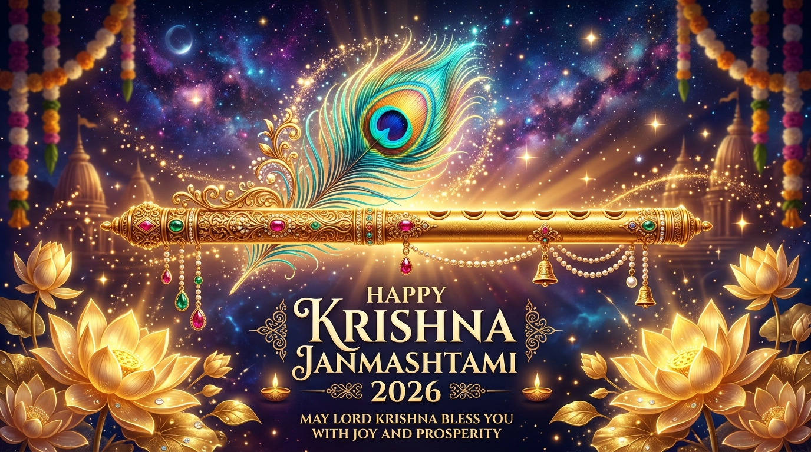

# Krishna Janmashtami 2026 — Interactive Tribute Web Application



A visually opulent, high-performance, single-file static web application created to celebrate the auspicious festival of **Shri Krishna Janmashtami 2026**. Built with pure Semantic HTML5, Vanilla Modern CSS, and Native JavaScript/Web APIs, it delivers a 60–120 FPS responsive experience across mobile, tablet, and desktop devices without any external runtime dependencies.

---

## 🌟 Overview of `index.html`

[`index.html`](file:///d:/Playground/ParbonStatic/Janmashtami2026/index.html) is the complete, self-contained single-page application. It encapsulates all styling, interactive physics simulations, procedural audio synthesis engines, canvas renderers, and responsive semantic markup.

### 🦚 Key Features & Interactive Modules

1. **Hero & Celestial Midnight Starfield**:
   - Deep midnight background (`#060d17`) featuring radiant gold (`#FFB703`) and peacock teal (`#0a9396`) lighting accents.
   - Dynamic HTML5 canvas starfield that throttles based on tab visibility for zero GPU waste.
   - Animated peacock feather badge, devotional Sanskrit shlokas, and smooth scroll navigation.

2. **Divine Legends & Sacred Traditions**:
   - Interactive narrative cards detailing the *Janma Lila* (Divine Advent in Mathura), *Yamuna Crossing* by Vasudeva, and *Vrindavan Lilas*.
   - Showcase of traditional rituals: *Upavasa* (Nirjala fasting), *Nishita Kaal Aarti*, *Panchamrit Abhishek*, and *Sankirtan*.

3. **Interactive 3D Z-Axis Jhula Seva (Cradle)**:
   - True 3D perspective swing physics (`perspective: 1100px`, `transform-style: preserve-3d`) with stationary golden arch endpoints.
   - Forward and backward swing kinematics (`rotateX` and `translateZ`) along the Z-axis.
   - Unified pointer and touch drag controls allowing users to physically pull or push Bal Gopal's cradle with dynamic depth shadows and spring-back momentum.
   - Devotional swing counter (*Jhula Seva*) and *Pushpa Vrishti* (flower shower).

4. **Dahi Handi Butter-Burst Simulation**:
   - 4-phase interactive matki break sequence:
     1. **Strike**: Stick swings diagonally towards the earthen pot.
     2. **Stress**: Pot vibrates with flashing glowing fracture lines.
     3. **Rupture**: Terracotta splits apart with radial butter/makhan droplet splatter.
     4. **Respawn**: Auspicious golden aura appears to hang a fresh matki.
   - Procedural Web Audio sound effects: ceramic impact snap (triangle wave) and Govinda victory chimes ($E_6 \to G\sharp_6 \to B_6 \to E_7$).

5. **Bhagavad Gita Wisdom Grid**:
   - Curated timeless verses from the *Bhagavad Gita* with original Sanskrit text, phonetic transliteration, and English translation.
   - One-click quote copy functionality with celebratory haptic/confetti feedback.

6. **Festive Greeting Card Generator & HD Canvas Exporter**:
   - Real-time live card preview with customizable recipient and sender names, devotional wishes, festive themes (*Midnight*, *Peacock*, *Gold*, *Vrindavan*), and motifs.
   - High-resolution $1200 \times 800\text{ px}$ canvas rendering with word wrapping, ornamental borders, and instant HD PNG download.
   - One-click copy text and direct WhatsApp Web Share integration.

7. **Procedural Web Audio Engine**:
   - Pure sine-wave **Bansuri flute synthesizer** playing generative Indian classical melodies across Raag pentatonic frequencies.
   - Harmonics-rich **Temple Bell chime** synthesizing bronze resonance (1046.5 Hz, 2093.0 Hz, 3135.96 Hz) without external audio files.

8. **Ultra-Fast Offscreen Sprite-Blit Confetti Engine**:
   - Pre-renders emoji glyphs (`🌸`, `✨`, `🌼`, `💛`, `🌺`, `🦚`, `🥛`, `🍯`, `🧈`) onto 64x64 offscreen canvas sprites at startup.
   - Blits cached GPU textures in $\sim 0.005\text{ ms}$ per frame, eliminating text rasterization lag during celebrations.

9. **Zero-Request Vector Favicon & Rich Social Graph**:
   - Self-contained high-DPI SVG data URI favicon and Apple Touch Icon featuring the *Mor Pankh* (peacock feather) and golden *Bansuri* (flute).
   - High-resolution $1200 \times 675\text{ px}$ Open Graph / Twitter Card social preview banner ([`og-image.jpg`](file:///d:/Playground/ParbonStatic/Janmashtami2026/og-image.jpg)).
   - Rich Open Graph (`og:*`) and Twitter Card (`twitter:image`, `summary_large_image`) metadata for rich link previews across WhatsApp, Facebook, LinkedIn, Discord, and X.
   - Mobile browser theme-color (`#060d17`) and fullscreen web app status bar tokens.

---

## 🚀 Running the Project

Because the entire application is self-contained within [`index.html`](file:///d:/Playground/ParbonStatic/Janmashtami2026/index.html), no build tools or package managers are required.

### Option 1: Direct Browser Launch
Double-click [`index.html`](file:///d:/Playground/ParbonStatic/Janmashtami2026/index.html) or open it directly in any modern web browser (Chrome, Edge, Firefox, Safari).

### Option 2: Local HTTP Server (VS Code / Python / Node)
```bash
# Using Python 3
python -m http.server 8000

# Using Node.js (npx)
npx serve .
```
Navigate to `http://localhost:8000` in your browser.

---

## 🛠️ Technology Stack

- **Markup**: Semantic HTML5 (`<header>`, `<nav>`, `<main>`, `<section>`, `<footer>`, `<canvas>`, `<svg>`)
- **Styles**: Vanilla CSS3 (Custom Properties / Design Tokens, CSS Grid, Flexbox, 3D Transforms, Fluid `clamp()` Typography)
- **Scripting**: Modern Vanilla ECMAScript (Native Web Audio API, Canvas 2D Context, Touch & Pointer Events, Clipboard API)
- **External Assets**: Google Fonts (*Cinzel Decorative*, *Playfair Display*, *Poppins*, *Rozha One*)

---

## 📖 Deep-Dive Engineering Analysis

For detailed commit history breakdown, architecture diagrams, and mathematical formulations of the swing kinematics and audio synthesis, read [GEMINI.md](file:///d:/Playground/ParbonStatic/Janmashtami2026/GEMINI.md).